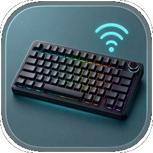
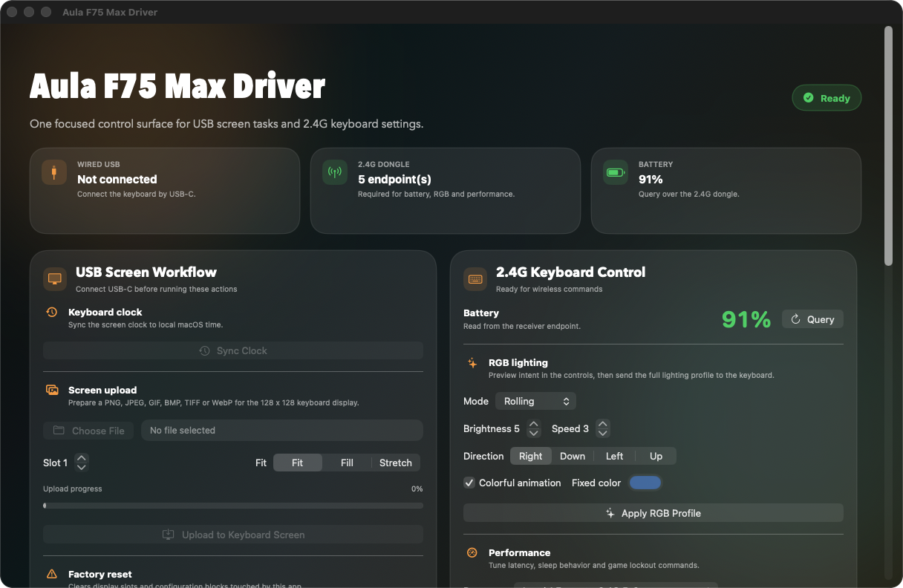
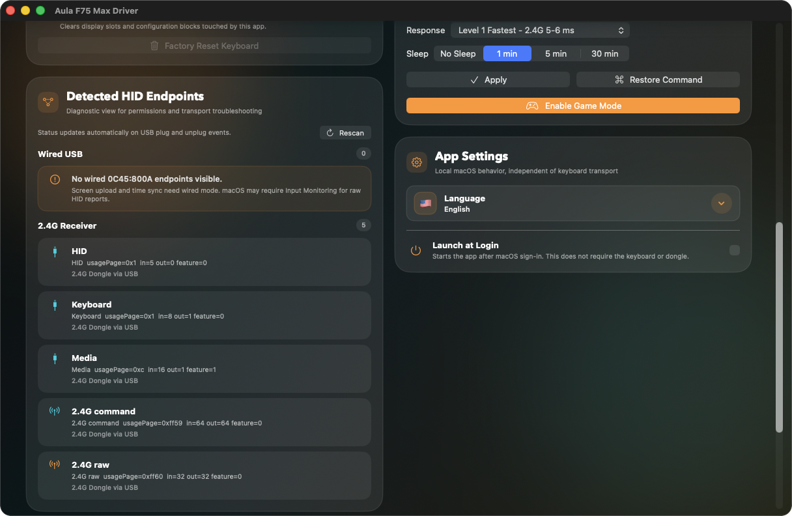

# Aula F75 Max Driver

<p align="center">
  
</p>

Native utility for configuring the Epomaker x Aula F75 Max keyboard on macOS and Linux.

The macOS app communicates directly with the keyboard and its 2.4G receiver through macOS HID APIs. The Linux app uses `hidapi` over `hidraw` and a native GTK4 interface. Both versions share the same portable protocol code where possible.

## Website

The promo and documentation site lives in `docs/` and is ready for GitHub Pages.

- Local entry point: `docs/index.html`
- Static assets: `docs/assets/` and `docs/screenshots/`
- GitHub Pages deployment workflow: `.github/workflows/pages.yml`
- Build workflow: `.github/workflows/build.yml` validates macOS DMG packaging and Linux DEB installer builds through the Makefile.
- Default site language: English
- Site languages: English, Russian, Spanish, Uzbek, Kazakh, Portuguese, Simplified Chinese

After pushing to `main` or `master`, GitHub Actions publishes the `docs/` directory through Pages. The workflow can also be started manually from the Actions tab.

## Screenshots





## Features

- Detects wired USB HID endpoints for the keyboard.
- Detects the 2.4G USB receiver.
- Reads keyboard battery percentage through the 2.4G receiver.
- Sends a local notification when battery level drops below 20%.
- Controls RGB mode, brightness, speed, direction, colorful animation, and fixed color.
- Configures response level, sleep timeout, Game Mode, and Command key restore behavior.
- Syncs the keyboard display clock to local system time.
- Uploads PNG, JPEG, GIF, BMP, TIFF, and WebP images to the 128 x 128 keyboard display.
- Supports animated GIF uploads with frame delays.
- Supports display fit modes: fit, fill, and stretch.
- Provides a factory reset flow for display slots and keyboard configuration blocks used by this implementation.
- Provides a diagnostic endpoint view for HID transport troubleshooting.
- Supports app language selection with bundled localizations.
- Ships native macOS and Linux builds with platform-specific integrations.
- Supports Launch at Login on macOS.

## Requirements

### macOS

- macOS 14 or newer.
- Apple Silicon Mac.
- Xcode Command Line Tools or a full Xcode installation.
- Aula F75 Max keyboard.
- USB-C wired connection for display upload, clock sync, and factory reset.
- 2.4G USB receiver for battery, RGB, performance, and Game Mode controls.

Some HID operations may require macOS Input Monitoring permission. If commands fail even though the keyboard is connected, grant permission in:

```text
System Settings -> Privacy & Security -> Input Monitoring
```

Then restart the app.

### Linux

- Ubuntu or Fedora on x86_64.
- Swift 6 toolchain.
- GTK4 development libraries.
- hidapi development libraries.
- Aula F75 Max keyboard and/or 2.4G receiver.
- udev access to the supported hidraw devices.

Ubuntu dependencies:

```sh
sudo apt install libgtk-4-dev libhidapi-dev pkg-config
```

Fedora dependencies:

```sh
sudo dnf install gtk4-devel hidapi-devel pkgconf-pkg-config
```

Source builds need the udev rule before running device commands:

```sh
sudo install -m 0644 packaging/linux/60-aula-f75-max.rules /etc/udev/rules.d/
sudo udevadm control --reload-rules
sudo udevadm trigger
```

Then replug the keyboard and receiver.

## Build and Run

Show available Make targets:

```sh
make help
```

### macOS

Build and package the app:

```sh
make macos-app
```

Open the packaged app:

```sh
open "build/Aula F75 Max Driver.app"
```

Build and open in one step:

```sh
make macos-run
```

Create a DMG installer image:

```sh
make macos-dmg
```

Compatibility aliases are kept for the original macOS workflow:

```sh
make all
make build
make app
make dmg
make run
```

### Linux

Build the native Linux GTK app:

```sh
make linux-build
```

Run the native Linux GTK app:

```sh
make linux-run
```

Build a Debian/Ubuntu installer package:

```sh
make linux-deb
sudo apt install ./build/AulaF75MaxDriver-v*_*.deb
```

The DEB installs the application launcher, desktop entry, icon, Swift runtime libraries needed by the release binary, and the udev rule. Replug the keyboard and receiver after installation.

Package a legacy tar.gz artifact for development workflows:

```sh
make linux-package
```

Other commands:

- `make macos-build` builds the macOS SwiftUI app binary in release mode for `arm64`.
- `make macos-app` builds and packages `build/Aula F75 Max Driver.app`.
- `make macos-dmg` builds a styled drag-to-install `build/Aula F75 Max Driver.dmg` with the app and an Applications shortcut.
- `make macos-run` builds and opens the macOS app bundle.
- `make linux-build` builds the native Linux GTK app on Linux.
- `make linux-deb` builds the Debian/Ubuntu installer in `build/`.
- `make linux-package` packages the Linux binary and udev rule into `build/AulaF75MaxDriverLinux.tar.gz` as a legacy developer artifact.
- `make linux-run` runs the native Linux GTK app on Linux.
- `make clean` removes `.build/` and `build/`.

The build output is local generated state and should not be committed.

## Usage

### Device Detection

The app starts a HID monitor when the main window appears. It automatically rescans when supported devices are connected or removed.

The overview cards show:

- Wired USB state.
- 2.4G receiver state.
- Battery state.

The endpoint diagnostics panel lists visible HID endpoints, usage pages, report sizes, product names, and transports. Use this panel first when a device command does not work.

### Wired USB Workflow

Use a wired USB-C connection for:

- Keyboard clock sync.
- Keyboard display image upload.
- Factory reset.

Display upload supports still images and animated GIFs. Images are rendered to the keyboard screen size of `128 x 128`, converted to RGB565, chunked into 4096-byte HID output reports, and sent to the selected display slot.

Slots must be in the range `1...255`.

Fit modes:

- `Fit` preserves aspect ratio and letterboxes when needed.
- `Fill` preserves aspect ratio and crops when needed.
- `Stretch` fills the full display without preserving aspect ratio.

### 2.4G Keyboard Control

Use the 2.4G receiver for:

- Battery query.
- RGB lighting profile.
- Response level.
- Sleep timeout.
- Game Mode.
- Command key restore.

The app polls battery periodically while the receiver is present. Manual battery query is also available from the main window.

### Launch at Login

Launch at Login is managed through the macOS ServiceManagement framework. It can be toggled from the app settings panel.

## Project Layout

```text
.
|-- Package.swift
|-- Info.plist
|-- Makefile
|-- Sources/
|   `-- AulaF75MaxDriver/
|       |-- AulaF75MaxDriverApp.swift
|       |-- ContentView.swift
|       |-- AppViewModel.swift
|       |-- AulaDevice.swift
|       |-- WirelessAulaDevice.swift
|       |-- DisplayEncoder.swift
|       |-- HIDDeviceMonitor.swift
|       |-- BatteryNotificationService.swift
|       |-- LaunchAtLogin.swift
|       |-- Localization.swift
|       |-- AulaTypes.swift
|       `-- Resources/
|           |-- en.lproj/
|           |-- ru.lproj/
|           |-- es.lproj/
|           |-- uz.lproj/
|           |-- kk.lproj/
|           |-- pt.lproj/
|           `-- zh-Hans.lproj/
`-- build/
```

Linux-specific code is split into separate targets under `Sources/AulaCore/`, `Sources/AulaLinuxHID/`, `Sources/AulaLinuxApp/`, and `Sources/CAulaLinuxGTK/`.

Important files:

- `AulaF75MaxDriverApp.swift` defines the SwiftUI app, main window, and AppKit window appearance configuration.
- `ContentView.swift` contains the main SwiftUI interface.
- `AppViewModel.swift` owns app state, task orchestration, device refreshes, battery polling, and log messages.
- `AulaDevice.swift` handles wired keyboard HID communication.
- `WirelessAulaDevice.swift` handles 2.4G receiver communication.
- `DisplayEncoder.swift` converts image files into the keyboard display payload format.
- `HIDDeviceMonitor.swift` watches for supported HID attach and removal events.
- `AulaTypes.swift` contains the current macOS app protocol constants, shared errors, endpoint metadata, and upload progress types.
- `AulaCore` contains portable packet builders and shared types used by the Linux implementation.
- `Localization.swift` resolves bundled localized strings and language override behavior.

## Architecture

The macOS app is a Swift Package executable target using SwiftUI for UI and AppKit/IOKit for macOS integration. The Linux app is a separate native GTK4 executable using hidapi/hidraw.

High-level flow:

1. `AulaF75MaxDriverApp` creates a shared `AppViewModel`.
2. `ContentView` renders state and invokes view model actions.
3. `AppViewModel` starts HID monitoring, runs device commands, updates logs, and manages background battery polling.
4. `AulaDevice` and `WirelessAulaDevice` perform low-level HID report operations.
5. `DisplayEncoder` prepares display payloads before upload.

Device commands run off the main actor where appropriate, then publish UI state back on the main actor.

## HID Endpoints

Known device identifiers:

- Wired keyboard: vendor `0x0c45`, product `0x800a`.
- 2.4G receiver: vendor `0x05ac`, product `0x024f`.

Known usage pages:

- Wired command: `0xff13`.
- Wired raw display: `0xff68`.
- 2.4G command: `0xff59`.
- 2.4G raw: `0xff60`.

The app also uses report size heuristics as fallbacks where needed.

## Localization

Bundled localizations currently include:

- English
- Russian
- Spanish
- Uzbek
- Kazakh
- Portuguese
- Simplified Chinese

The selected language is stored in `UserDefaults` under `app.language.code`. The `system` option uses the default bundle resolution.

## Testing

There is currently no automated test target in `Package.swift`. The shared `AulaCore` target is compiled as part of the package build.

Recommended validation before a release:

```sh
make clean
make macos-app
```

Linux validation should be run on Ubuntu or Fedora after installing the documented GTK4, hidapi, and udev dependencies:

```sh
make linux-build
make linux-run
```

Manual validation:

- Launch the packaged app.
- Connect the keyboard over USB-C and verify wired endpoints appear.
- Connect the 2.4G receiver and verify receiver endpoints appear.
- Query battery.
- Apply a harmless RGB profile.
- Sync keyboard clock.
- Upload a small test image to a non-critical display slot.
- Switch app language and verify the UI updates correctly.
- Toggle Launch at Login if that behavior changed.

If tests are added later, place them under `Tests/` and run them with:

```sh
swift test
```

## Troubleshooting

### The keyboard is connected but not detected

- Check the diagnostic endpoint panel.
- Try reconnecting the keyboard or receiver.
- Try a direct USB port instead of a hub.
- Grant Input Monitoring permission and restart the app.
- Run `make clean && make macos-app` if testing a fresh local macOS build.

### Battery is unavailable

Battery query requires the 2.4G receiver. Wired USB endpoints alone are not enough for the current battery implementation.

### Display upload fails

- Use wired USB-C mode.
- Confirm that the wired display endpoint is visible.
- Try a smaller still image first.
- Confirm that the selected slot is between `1` and `255`.
- Grant Input Monitoring permission if acknowledgements are not received.

### RGB or performance commands fail

- Use the 2.4G receiver.
- Confirm that the `2.4G raw` endpoint is visible.
- Reconnect the receiver and rescan.

### Launch at Login does not change

Launch at Login depends on macOS ServiceManagement behavior and app bundle identity. Test it from the packaged `.app`, not from a raw SwiftPM executable.

## Limitations

- The app is currently packaged from SwiftPM with a Makefile, not from a full Xcode app project.
- There is no WidgetKit extension. The standard macOS Batteries widget cannot be extended from this package layout.
- Automated tests are not configured yet.
- Hardware-dependent behavior requires a real Aula F75 Max keyboard and receiver.
- The protocol implementation is based on observed/public packet flows and may need updates for firmware variants.

## Security Notes

- Do not commit generated build output.
- Do not commit pairing data, device secrets, or private diagnostic captures.
- This app communicates with HID devices from user space and does not install kernel extensions.

## License

See [LICENSE](LICENSE).
